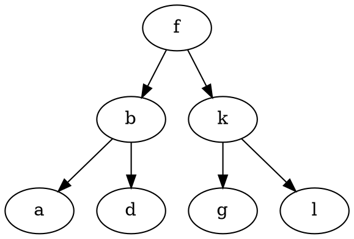

- Двоичное дерево поиска. Узел дерева. Сравнение с деревом. Добавление.
- Двоичное дерево поиска. Узел дерева. Сравнение с деревом. Поиск. Рекурсивный и итеративный.
- Двоичное дерево поиска. Узел дерева. Сравнение с деревом. Универсальный обход.
- Двоичное дерево поиска. Узел дерева. Сравнение с деревом. Удаление.
---

**Дерево** - связный ациклический граф.

**Двоичное дерево поиска** - это дерево, все вершины которого упорядочены, каждая вершина имеет не более двух потомков (назовём их левым и правым), и все вершины, кроме корня, имеют родителя.

У двоичного дерева значение левого потомка меньше значения родителя, а значение правого потомка больше значения родителя для каждого узла дерева. Это свойство позволяет реализовать эффективный поиск. 

*Узел дерева* обычно состоит из двух частей:
- информационная часть (данные);
- ссылочная часть (связь с другими узлами).

#### **Узел**

```c
struct tree_node
{
	// данные
	const char *name;

	// родитель 
	// struct tree_node *parent;
	
	// меньшие 
	struct tree_node *left;
	// большие
	struct tree_node *right;
};

struct tree_node *create_node(const char *name)
{
	struct tree_node *node = malloc(sizeof(struct tree_node));
	if (node)
	{
		node->name = name;
		node->left = NULL;
		node->right = NULL;
	}	
	return node;
}

void node_free(struct tree_node_t *node)
{
	free(node);
}
```

#### **Добавление узла в дерево. Рекурсивное и итеративное**

```c
// рекурсивное
struct tree_node *insert(struct tree_node *tree, struct tree_node *node)
{
	int cmp;
	if (tree == NULL)
		return node;

	cmp = strcmp(node->name, tree->name);
	if (cmp == 0)
		assert(0);
	else if (cmp < 0)
		tree->left = insert(tree->left, node);
	else
		tree->right = insert(tree->right, node);

	return tree;
}

// итеративное
struct tree_node *insert(struct tree_node *tree, struct tree_node *node)
{
	int cmp;
	if (tree == NULL)
		return node;

	struct tree_node *cur = tree;
	struct tree_node *parent = NULL;

	while (cur)
	{
		parent = cur;
		cmp = strcmp(node->name, cur->name);
		if (cmp == 0)
			assert(0);
		else if (cmp < 0)
			cur = cur->left;
		else 
			cur = cur->right;
	}

	if (cmp < 0)
		parent->left = node;
	else
		parent->right = node;

	return tree;
}
```

#### **Освобождение памяти**

```c
void free_tree(struct tree_node *tree)
{
	if (!tree)
		return;

	free_tree(tree->left);
	free_tree(tree->right);
	free(tree);
}
```

#### **Поиск. Рекурсивный и итеративный**

```c
// рекурсивный
struct tree_node *lookup(struct tree_node *tree, const char *name)
{
	int cmp;
	if (tree == NULL)
		return NULL;
	cmp = strcmp(name, tree->name);
	if (cmp == 0)
		return tree;
	else if (cmp < 0)
		return loookup(tree->left, name);
	else 
		return lookup(tree->right, name);
}

// итеративный
struct tree_node *lookup(struct tree_node *tree, const char *name)
{
	int cmp;
	while (tree)
	{
		cmp = strcmp(name, tree->name);
		if (cmp == 0)
			return tree;
		else if (cmp < 0)
			tree = tree->left;
		else 
			tree = tree->right;
	}
	return NULL;
}
```

#### **Удаление. Рекурсивное и итеративное**

```c
struct tree_node *find_min(struct tree_node *tree)
{
	while (tree->left)
		tree = tree->left;
	return tree;
}

// рекурсивное
struct tree_node *delete_node(struct tree_node *tree, const char *name)
{
	if (!tree)
		return NULL;
	int cmp = strcmp(name, tree->name);
	if (cmp < 0)
		tree->left = delete_node(tree->left, name);
	else if (cmp > 0)
		tree->right = delete_node(tree->right, name);
	else 
	{
		// узел с одним потомком: заменить указатель родителя на потомка
		if (!tree->left)
		{
			struct tree_node *tmp = tree->right;
			free(tree);
			return tmp;
		} 
		else if (!tree->right)
		{
			struct tree_node *tmp = tree->left;
			free(tree);
			return tmp;
		}

		// узел с двумя потомками

		// 1. найти минимальный элемент в правом поддереве (или макс. в левом)
		struct tree_node *tmp = find_min(tree->right);

		// 2. заменить узел на его потомка
		strcpy(tree->name, tmp->name);

		// 3. затем удалить найденный минимальный элемент
		tree->right = delete_node(tree->right, tmp->name);
	}

	return tree;
}

// итеративное
struct tree_node *delete_node(struct tree_node *tree, const char *name)
{
	struct tree_node *parent = NULL, *cur = tree;
	
	while (cur && strcmp(name, cur->name) != 0)
	{
		parent = cur;
		if (strcmp(name, cur->name) < 0)
			cur = cur->left;
		else 
			cur = cur->right;
	}

	// узел не найден
	if (!cur)
		return tree;

	// узел - лист
	if (!cur->left && !cur->right)
	{
		if (!parent)
			return NULL;
		if (parent->left == cur)
			parent->left = NULL;
		else
			parent->right = NULL;

		free(cur);
		return tree;
	}

	// узел с одним потомком: заменить указатель родителя на потомка
	if (!current->left || !current->right) 
	{
        struct tree_node *child = (current->left) ? current->left : current->right;
        if (!parent) 
	        return child; // Удаляемый узел — корень
        if (parent->left == current) 
	        parent->left = child;
        else 
	        parent->right = child;
        free(current);
        return root;
    }

	// узел с двуми потомками

	// 1. найти минимальный элемент в правом поддереве

	struct tree_node *successor_parent = cur;
	struct tree_node *successor = cur->right;

	while (successor->left)
	{
		successor_parent = successor;
		successor = successor->left;
	}	
	
	// 2. заменить узел этим элементом
	
	strcpy(cur->name, successor->name);
	
	// 3. затем удалить найденный узел

	if (successor_parent->left == successor)
		successor_parent->left = successor->right;
	else
		successor_parent->right = successor->right;

	free(successor);

	return tree;
}
```

#### **Обход**

```c
// префиксный (копирование дерева)
void prefix(node_t *tree, void (*f) (struct tree_node *tree, void *arg), void *arg)
{
	if (tree == NULL)
		return;

	f(tree, arg);
	prefix(tree->left);
	prefix(tree->right);
}

// инфиксный (сортировка)
void prefix(node_t *tree, void (*f) (struct tree_node *tree, void *arg), void *arg)
{
	if (tree == NULL)
		return;

	prefix(tree->left);
	f(tree, arg);
	prefix(tree->right);
}

// постфиксный (удаление дерева)
void prefix(node_t *tree, void (*f) (struct tree_node *tree, void *arg), void *arg)
{
	if (tree == NULL)
		return;

	prefix(tree->left);
	prefix(tree->right);
	f(tree, arg);
}
```

#### **DOT**

- DOT - язык описания графов.
- Граф, описанный на языке DOT, обычно представляет собой текстовый файл с расширением .gv в понятном для человека и обрабатывающей программы формате.
- В графическом виде графы, описанные на языке DOT, представляются с помощью специальных программ, например Graphviz.



```c
void to_dot(struct tree_node *tree, void *param)
{
	FILE *f = param;
	if (tree->left)
		fprintf(f, "%s -> %s;\n", tree->name, tree->left->name);
	if (tree->right)
		fprintf(f, "%s -> %s;\n", tree->name, tree->right->name);
}

void export_to_dot(FILE *f, const char *tree_name, struct tree_node *tree)
{
	fprintf(f, "digraph %s {\n", tree_name);
	apply_pre(tree, to_dot, f);
	fprintf(f, "}\n");
}
```

